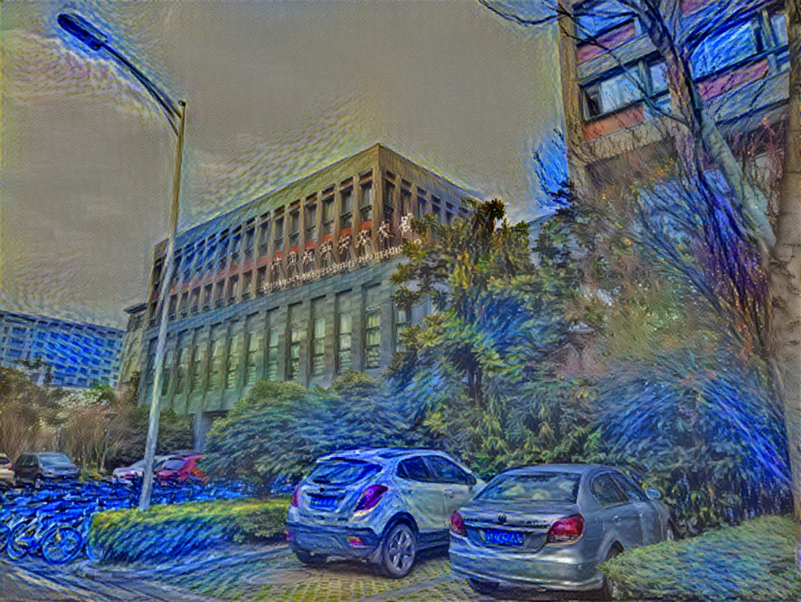

# Neural-Style-TZ

Last modified @ 2019/11/19

## contibutor
tuzhuo @ croplab, HZAU

##operating environment:
1. Intel(R) Xeon(R) Gold 6140 CPU @ 2.30GHz * 2 (36 cores)
2. Tesla P100-PCIE-16GB * 2
3. 512GB RAM
4. tensorflow-gpu, NumPy, SciPy, Pillow, CUDA, vgg.mat

##Appendix
[source project](https://github.com/anishathalye/neural-style)