# Neural-Style-TZ

Last modified @ 2019/11/19

## contributor
tuzhuo @ croplab, HZAU

## operating environment:
1. Intel(R) Xeon(R) Gold 6140 CPU @ 2.30GHz * 2 (36 cores)
2. Tesla P100-PCIE-16GB * 2
3. 512GB RAM
4. tensorflow-gpu, NumPy, SciPy, Pillow, CUDA, imagenet-vgg-verydeep-19.mat
5. for a 1200*950 pixel image, with the environment above, it only takes 5 mins for 1000 iterations. Using a GPU is highly recommended due to the huge speedup.

## performance:

### source image
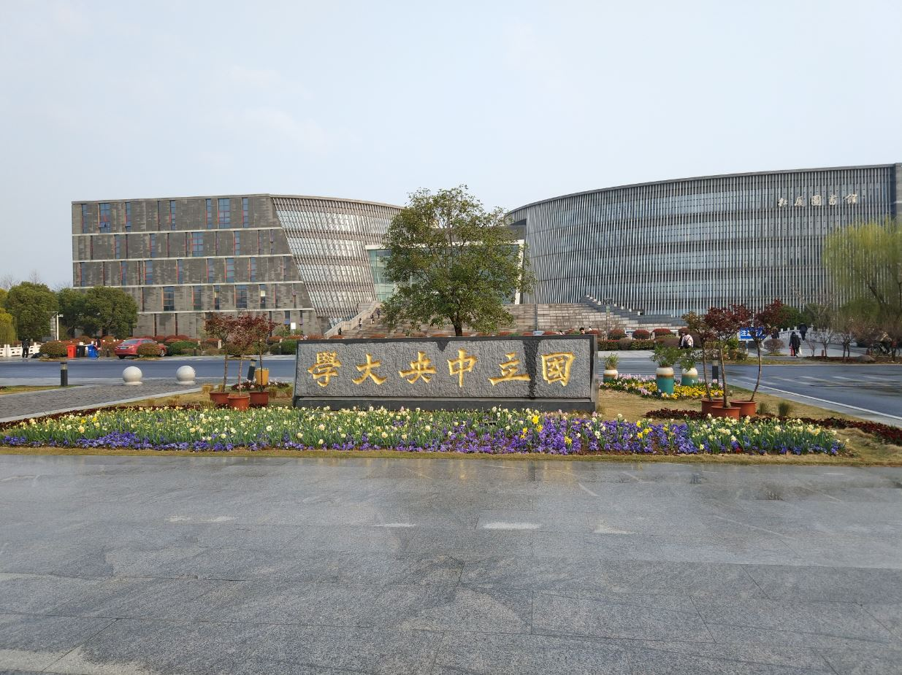

### style transfer 1

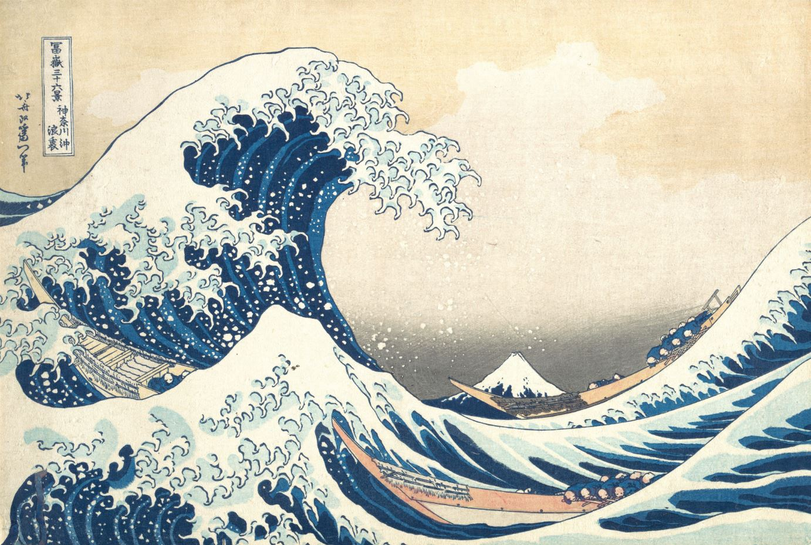
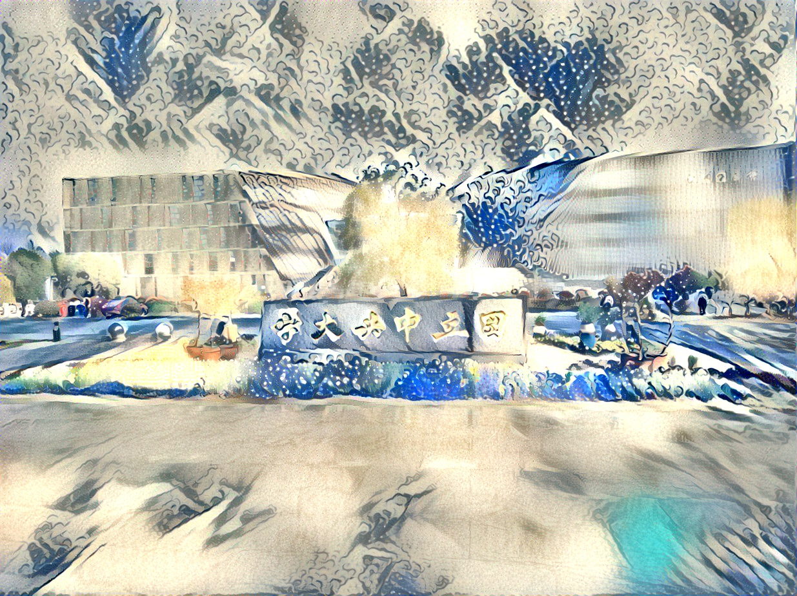

### style transfer 2

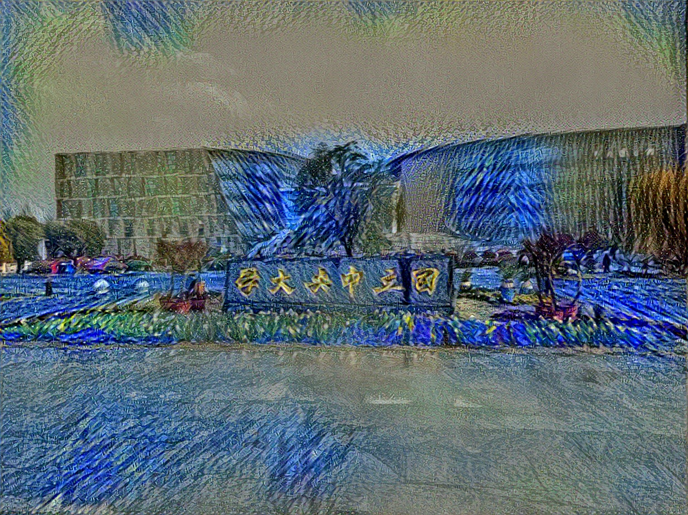

### style transfer 3

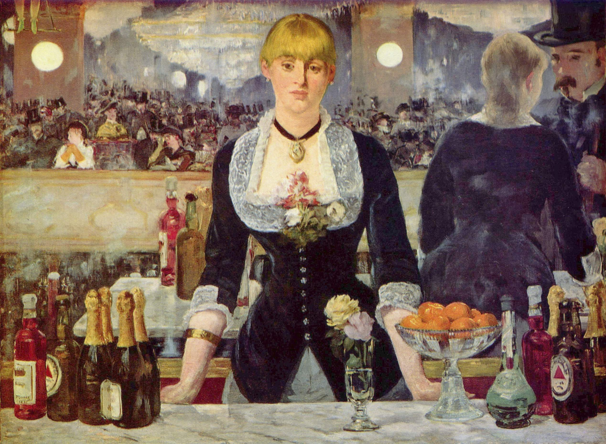
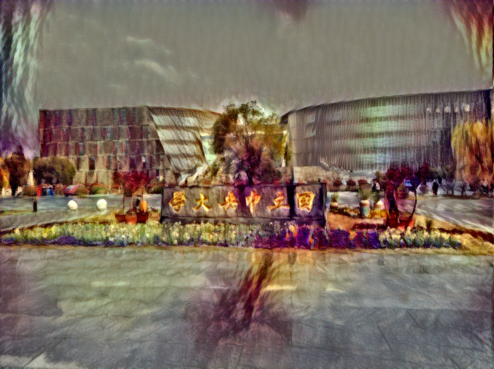

### style transfer 4

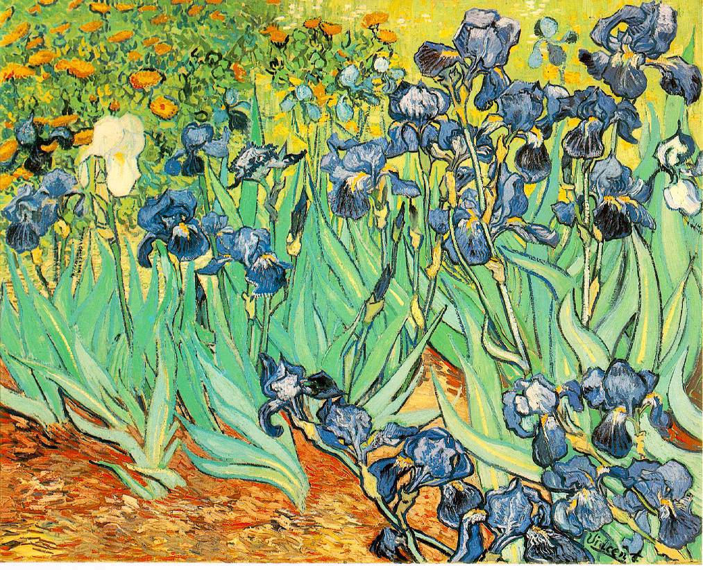
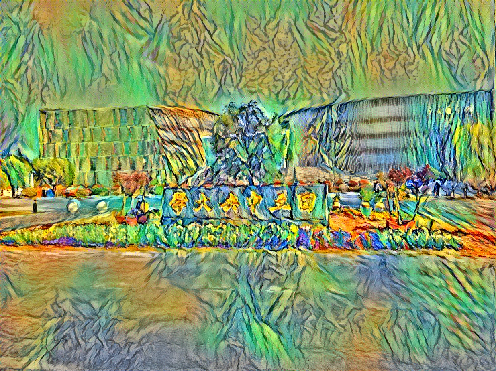

### style transfer 5

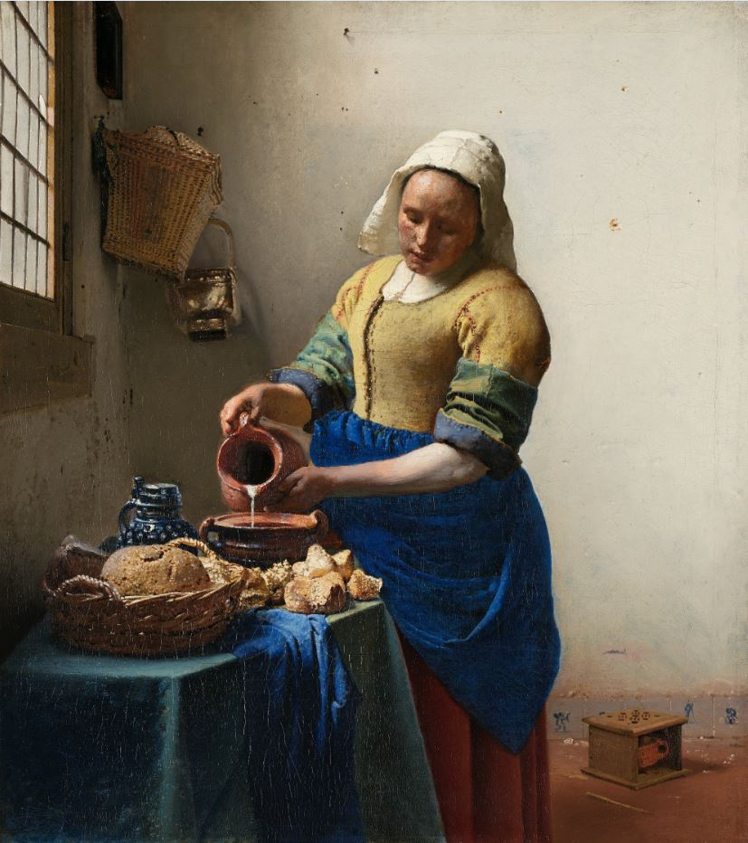
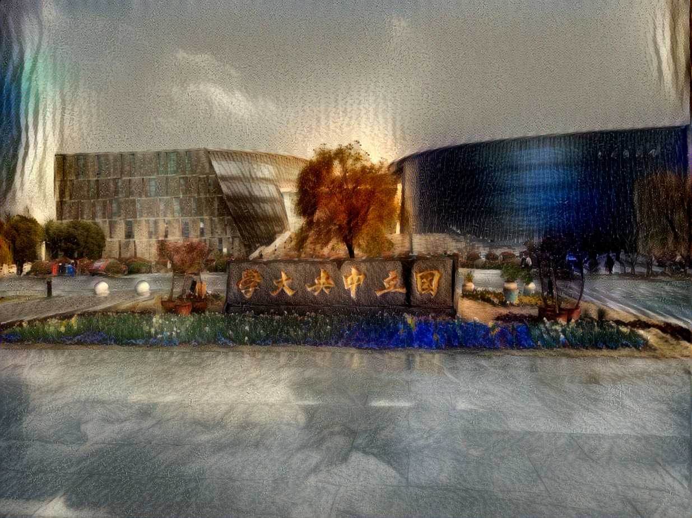

### style transfer 6

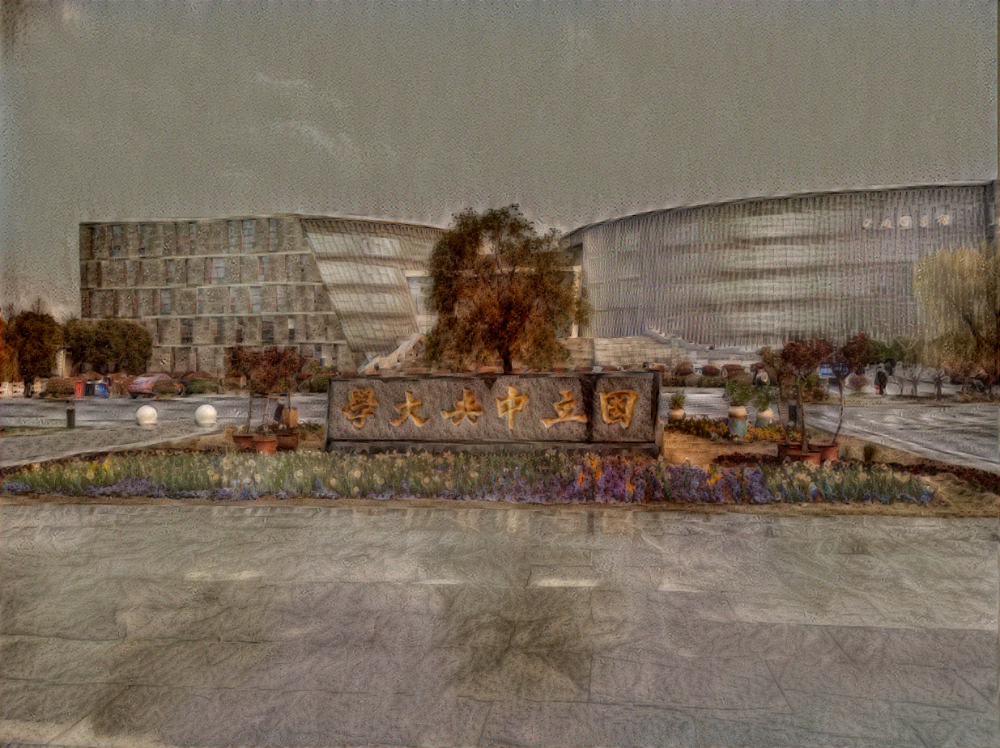

## Appendix
[source project](https://github.com/anishathalye/neural-style)
